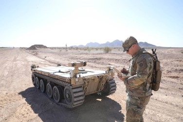
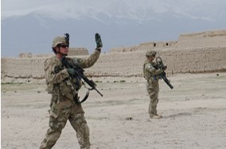

# Visual Signals for Q-UGV
Objective: To develop the ability for an operator to control a robot through hand and arm signals, and explore the practicality of controllerless robot tasking in a tactical environment.

### Perception: [Intel RealSense D455](https://www.intelrealsense.com/depth-camera-d455f/) camera and [Nuitrack](https://nuitrack.com/) skeletal tracking software.
### Robot: [Boston Dynamics Spot](https://bostondynamics.com/products/spot/)
### Software Development Kit: [BD GitHub](https://github.com/boston-dynamics/spot-sdk/blob/master/docs/python/quickstart.md) or [BD Developer Site](https://dev.bostondynamics.com/)
### ROS Wrapper: [Clearpath Spot ROS](https://www.clearpathrobotics.com/assets/guides/melodic/spot-ros/index.html#)

### Gestures: [Hand & Arm Signals for Ground Vehicles](https://armypubs.army.mil/epubs/DR_pubs/DR_a/pdf/web/ARN2747_TC%203-21x60%20FINAL%20WEB.pdf) (Chapter 2, Army Field Manual 21-60).

*Repo Maintainers: 
CDT Alex Murawski
alex.murawski@westpoint.edu 
CDT Landon Stauffer
landon.stauffer@westpoint.edu 
Mr. Pratheek Manjunath
pratheek.manjunath@westpoint.edu*
